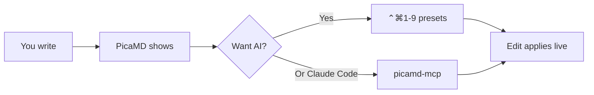

# Welcome to PicaMD 👋

You're looking at a Markdown file rendered **inline as you type**.
Move your cursor onto the next paragraph — the `**` markers around
that bold word disappear. Click back into them and they come back.
That's the live-preview model: the text never gets reformatted into
a different mode, you're always editing the actual Markdown source.

## Try the AI presets

Settings → AI (`⌘,` then click the AI tab) lets you wire up Anthropic
Claude, OpenAI, or a local LM Studio / Ollama. Off by default. Once
configured:

- Select a paragraph
- `⌃⌘1` — Bereinige Markdown (cleans typography, em-dashes, etc.)
- `⌃⌘2` — Fasse zusammen (3-bullet summary as blockquote)
- `⌃⌘3` — Schreibe natürlicher (rewrite for flow)
- `⌃⌘4` — Erweitere diesen Absatz (continue writing)
- `⌃Space` — fuzzy-search picker over all 9 presets

Every preset is fully editable in Settings → AI → Presets.
Add your own, change the prompts, rebind hotkeys.

## Hand a file to Claude Code via MCP

PicaMD ships an MCP server (`picamd-mcp`) that lets Claude Code
read and edit your open documents *by section*, not by re-reading
the whole file each pass. Add to your `~/.config/claude-code/mcp.json`:

```json
{
  "mcpServers": {
    "picamd": {
      "command": "/Applications/PicaMD.app/Contents/Resources/picamd-mcp"
    }
  }
}
```

Then in Claude Code:

> "What's the Methods section of the doc I have open in PicaMD?
> Rewrite the second paragraph to be tighter."

Claude calls `workspace.openDocuments`, `document.outline`,
`document.readSection`, and `document.replaceLines` — and your
edit appears live in the editor here, since PicaMD's file-watcher
picks up the change.

## Render anything

Math: $a^2 + b^2 = c^2$ inline, or display:

$$
\sum_{n=1}^{\infty}\frac{1}{n^2} = \frac{\pi^2}{6}
$$

Mermaid:



Tables:

| Shortcut | What it does |
|---|---|
| `⌘,` | Settings (themes, AI, presets) |
| `⌘T` | New tab (with macOS tabbing on) |
| `⌘⇧P` | Command palette (fuzzy over headings) |
| `⌃⌘F` | Focus mode (dim non-cursor paragraphs) |
| `⌃⌘Y` | Typewriter mode (cursor stays centered) |
| `⌃Space` | AI preset picker |
| `⌃⌘1`–`⌃⌘9` | AI preset by hotkey |

Code blocks with syntax highlighting:

```swift
struct PicaMDApp: App {
    var body: some Scene {
        DocumentGroup(newDocument: MarkdownDocument()) { file in
            ContentView(document: file.$document)
        }
    }
}
```

Footnotes are real too[^1].

[^1]: They render as a numbered superscript inline and a footer
    block at the bottom of HTML exports.

## Export anywhere

`File → Export As…` covers:

- **HTML** — in-process, fully self-contained file with embedded
  CSS, KaTeX (CDN), Mermaid (CDN). Works offline once cached.
- **PDF / DOCX / EPUB** via `pandoc` (auto-detected if installed).
  `brew install pandoc` if missing.

## Privacy

Nothing is sent to any server you didn't configure yourself. AI
endpoints, MCP — all local or directed at your chosen API. No
telemetry, no analytics, no PicaMD-owned proxy. The README covers
this in detail.

## Where to next

- **Settings → Palette / Typography** to make this comfortable for
  *your* eyes (try Editorial preset for a serif H1 / sans body
  combo).
- **Add an AI preset** for whatever you do most ("Translate to
  English", "Make it pirate-speak", whatever).
- **File a bug** at <https://github.com/michiwickman/picamd/issues>
  if something's off — the alpha needs your eyes.

Have fun.
